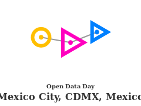

# OpenDataDay Workshop UAM AZC (CDMX México)

> The main languague of the final material is spanish, this english page is only for 
> references in external sites. 

This repository has the open data day workshop content for the UAM AZC

The main theme of this workshop is analyzing the crime issues around our university.
The data sources are open data from goverment and citizens. 

## Prerequisites

The technical prerequisites are listed [here](Prerrequisitos.md).

This workshop was designed to show the use and potential of Open Data. 
If you know how to:

1. Use a computer.
2. Install Programs in computers.
3. You are no afraid to learn new things.

you can take this workshop. :smile:

> Only the third is mandatory 
> If you need some help installing the software before the workshop
> send me a email: bt0dotninja AT fedoraproject DOT org 
> just change AT for @ and DOT for .

## 

## Data sources
* [datos.gob.mx](https://datos.gob.mx/)
* [datamx](http://datamx.io/)
* [Sitio del Secretariado Ejecutivo](http://secretariadoejecutivo.gob.mx/incidencia-delictiva/incidencia-delictiva-datos-abiertos.php)
* [Sitio hoyodecrimen](https://hoyodecrimen.com/)

## Geographical data and maps

* [OpenStreetMap](http://www.openstreetmap.org)
* [INEGI](http://www.inegi.org.mx/)

## Data Licenses

* [Libreuso](https://datos.gob.mx/libreusomx) compatible with [Attribution 4.0 International (CC BY 4.0)](https://creativecommons.org/licenses/by/4.0/)

## About us

We are the local LUG (Linux User Group) of the UAM AZC, this means than we are linux and open source lovers :heart:.
you can find more about us in: www.soul-tlamaqui.org.

